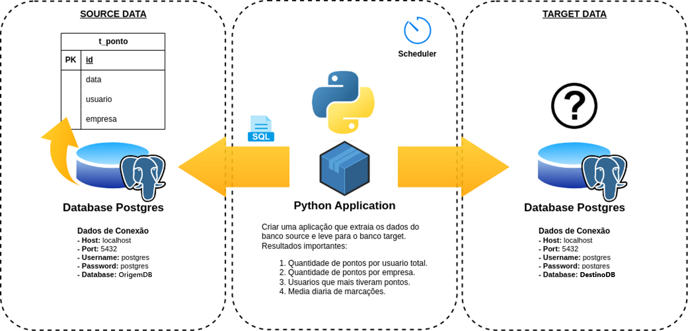

# Teste para analista de dados

Este repositório armazena um pequeno projeto para uma entrevista de analise de dados.

#### Indice

- [Proposta](#proposta)
- [Minha solução para o problema](#minha-solução)
- [Como executar](#executando-o-projeto)
- [Considerações](#considerações)

### Proposta
A proposta é bem simples:


- Realizar a migração dos dados entre SOURCE e TARGET
- Utilizar Docker no Projeto
- Python com alguma forma de agendamento
- Enviar um relatório sumarizando os itens.
  - Quantidade de pontos por usuário
  - Quantidade de pontos por empresa
  - 10 Usuários com mais pontos
  - Média de marcações

---
## Minha Solução
### Jujpyter - Faker - Mock Data
o arquivo mock_data.ipynb dentro da pasta scripts, foi usado para criar os dados mockados.
Utilizei a lib faker para gerar os emails e cnpj.
Também implemente de forma a garantir que um mesmo usuário pertencesse sempre a uma mesma empresa.

### PostgreSQL - Origem
Rodando no docker com script de inicialização contendo os dados criados anteriomente.

### PostgreSQL - Destino
Também rodando no docker 

### Airflow
????

---
## Executando o projeto

### REQUISITOS:
 - Docker
 - Python (3.9+) 

### Arquivo: **projeto.py**

Este arquivo foi criado para facilitar a execução do projeto.

1. Configurar email  para receber os avisos:
   - O projeto precisa de um email apenas para receber os alertas e resultados dos processos de etl.
   - na raiz do projeto execute: `python projeto.py --configurar`
2. Rodando o projeto:
   - Para executar o projeto execute: `python projeto.py --iniciar`
   - Este comando irá criar os containers necessários para a execução.
   - Para acessar o airflow e ver o pipeline acesse [localhost:8080](http://localhost:8080).
   - Para acessar o banco de dados de ORIGEM:
   ```shell
   Servidor: localhost
   Porta: 10000
   Usuário: postgres
   Senha: senhasourcedb
   ```
   - Para acessar o banco de dados de DESTINO:
   ```shell
   Servidor: localhost
   Porta: 11000
   Usuário: postgres
   Senha: senhatargetdb
   ```
3. Parando o projeto:
   - Após avaliar o projeto execute: ``

---
## Considerações
???